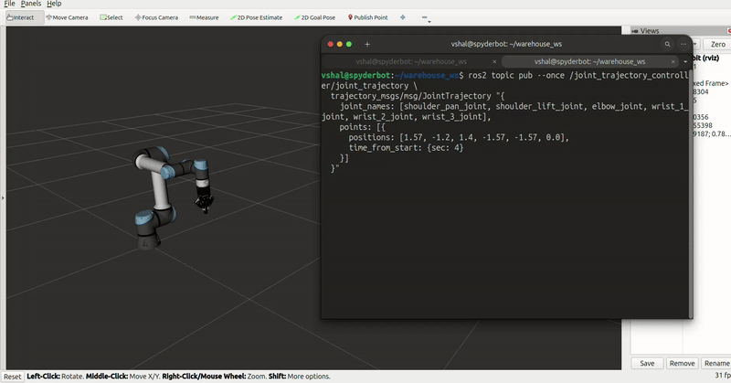
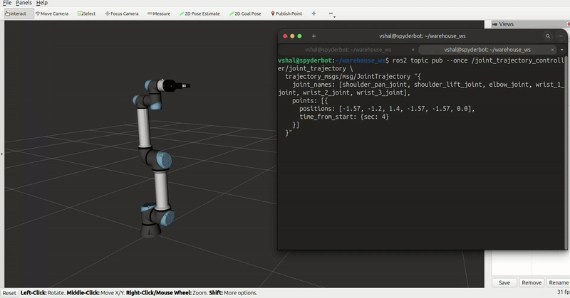
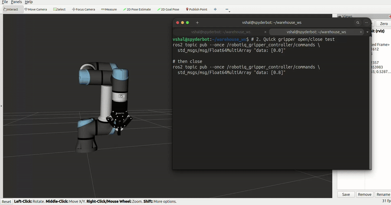
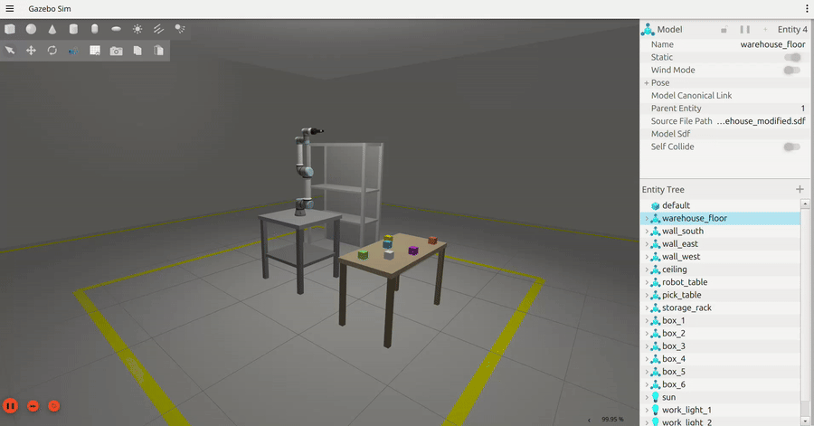

# 🏭 Warehouse Automation — ROS2 + Gazebo Harmonic

<div align="center">


**A full warehouse pick-and-place simulation using UR5e robotic arm + Robotiq 2F-85 gripper, built from scratch with ROS2 Jazzy and Gazebo Harmonic.**

</div>

---

## 📋 Table of Contents

- [Project Overview](#-project-overview)
- [Stack](#-stack)
- [Workspace Structure](#-workspace-structure)
- [Phase 1 — Robot Setup](#-phase-1--robot-setup-in-simulation)
- [Phase 2 — Warehouse World](#-phase-2--warehouse-world)
- [Phase 3 — MoveIt2 + Pick and Place](#-phase-3--moveit2--pick-and-place-coming-soon)
- [Getting Started](#-getting-started)
- [Troubleshooting](#-troubleshooting)

---

## 🎯 Project Overview

This project simulates a warehouse pick-and-place operation where a **UR5e robotic arm** mounted on a workbench picks coloured boxes from a pick table and places them onto a storage rack — all inside a realistic warehouse environment.

**Goals:**
- Full robot + gripper simulation with real physics
- Warehouse environment with tables, racks, and dynamic boxes
- MoveIt2 motion planning for collision-free trajectories
- Vision-based box detection using RGB-D camera (Intel RealSense D435 simulated)

---

## 🛠 Stack

| Component | Technology |
|---|---|
| OS | Ubuntu 24.04 |
| ROS 2 | Jazzy |
| Simulator | Gazebo Harmonic |
| Robot | Universal Robots UR5e |
| Gripper | Robotiq 2F-85 |
| Physics Engine | Bullet Featherstone |
| Motion Planning | MoveIt2 *(Phase 3)* |
| Perception | OpenCV + PCL *(Phase 3)* |

---

## 📁 Workspace Structure

```
warehouse_ws/
└── src/
    ├── warehouse_description/       # URDF/Xacro — robot + gripper + camera assembly
    ├── warehouse_gazebo/            # World SDF, models, spawn launch
    ├── warehouse_moveit_config/     # MoveIt2 config (Phase 3)
    ├── warehouse_bringup/           # Top-level launch files
    ├── warehouse_tasks/             # Pick and place task nodes (Phase 3)
    ├── docs/images/                 # README media
    │
    │   — Third-party (cloned, not committed) —
    ├── Universal_Robots_ROS2_Description/
    ├── Universal_Robots_ROS2_GZ_Simulation/
    ├── Universal_Robots_ROS2_Driver/
    └── ros2_robotiq_gripper/
```

---

## ✅ Phase 1 — Robot Setup in Simulation

### What was built

- UR5e arm assembled with Robotiq 2F-85 gripper via UR-to-Robotiq adapter
- Full `ros2_control` stack — arm trajectory controller + gripper position controller
- Bullet Featherstone physics for mimic joint support
- Complete TF tree verified: `world → base_link → ... → tool0 → gripper`

### Architecture

```
ur5e_with_gripper.urdf.xacro
  ├── ur_macro.xacro            → UR5e kinematics (6 joints)
  ├── ur_gz.ros2_control.xacro  → Gazebo sim hardware interface
  ├── ur_to_robotiq_adapter     → Mechanical coupling (tool0 → gripper base)
  └── robotiq_2f_85_macro       → 2F-85 gripper with sim_gazebo:=true
```

### Controllers

| Controller | Type | Joints |
|---|---|---|
| `joint_state_broadcaster` | JointStateBroadcaster | All joints |
| `joint_trajectory_controller` | JointTrajectoryController | 6 UR5e joints |
| `robotiq_gripper_controller` | JointGroupPositionController | Gripper knuckle |

### Demo — Arm Movement





### Demo — Gripper Open / Close



### Launch

```bash
ros2 launch warehouse_description view_robot_gz.launch.py
```

### Quick Test Commands

```bash
# Source workspace
source ~/warehouse_ws/install/setup.bash

# Check all controllers are active
ros2 control list_controllers

# Move arm to ready pose
ros2 topic pub --once /joint_trajectory_controller/joint_trajectory \
  trajectory_msgs/msg/JointTrajectory "{
    joint_names: [shoulder_pan_joint, shoulder_lift_joint, elbow_joint, wrist_1_joint, wrist_2_joint, wrist_3_joint],
    points: [{positions: [0.0, -1.57, 1.57, -1.57, -1.57, 0.0], time_from_start: {sec: 3}}]
  }"

# Open gripper
ros2 topic pub --once /robotiq_gripper_controller/commands \
  std_msgs/msg/Float64MultiArray "data: [0.0]"

# Close gripper
ros2 topic pub --once /robotiq_gripper_controller/commands \
  std_msgs/msg/Float64MultiArray "data: [0.8]"
```

---

## ✅ Phase 2 — Warehouse World

### What was built

- 12m × 10m warehouse with concrete floor and yellow safety cell markings
- 3 walls with windows (South side open for camera view)
- Directional sunlight + 2 overhead point lights above workspace
- Robot mounting table (steel, 0.8×0.8×0.9m)
- Pick table (1.2×0.6×0.75m) with 6 coloured physics boxes in 2×3 grid
- Storage rack with 2 shelves (shelf 1 at z=0.55, shelf 2 at z=1.05)
- Box size: 70×70×70mm — fits Robotiq 2F-85 (85mm max opening)

### Layout

```
        North Wall (windows)
+------------------------------------------+
|                                          |
|   [RACK]          (open ceiling lights)  |
|                                          |
W         [ROBOT TABLE]                   E
a              [UR5e]        [BOX TABLE]  a
l                                         l
l                                         l
|                                         |
|              (open — South side)        |
+------------------------------------------+

Robot table:  (0.0,  0.0) — robot base at z=0.9m
Pick table:   (0.0,  1.55) — robot rotates ~90° to pick
Storage rack: (-1.6, -0.4) — robot rotates ~-120° to place
```

### Demo — Warehouse Overview



### Launch

```bash
ros2 launch warehouse_gazebo warehouse.launch.py
```

---

## 🔜 Phase 3 — MoveIt2 + Pick and Place *(Coming Soon)*

- [ ] MoveIt2 config — SRDF, kinematics, planning pipeline
- [ ] Simulated Intel RealSense D435 RGB-D camera on flange
- [ ] Box pose detection — color segmentation + point cloud (OpenCV + PCL)
- [ ] Pick and place task node — full autonomous sequence
- [ ] Place on shelf 1 then shelf 2

---

## 🚀 Getting Started

### Prerequisites

```bash
# ROS2 Jazzy + Gazebo Harmonic must be installed
# Ubuntu 24.04 recommended

sudo apt update
sudo apt install -y \
  ros-jazzy-ros2-control \
  ros-jazzy-ros2-controllers \
  ros-jazzy-gz-ros2-control \
  ros-jazzy-moveit \
  ros-jazzy-moveit-ros-planning-interface \
  ros-jazzy-moveit-setup-assistant \
  ros-jazzy-gripper-controllers \
  ros-jazzy-joint-state-publisher \
  ros-jazzy-xacro \
  ros-jazzy-robot-state-publisher \
  ros-jazzy-rviz2 \
  ros-jazzy-ros-gz-bridge \
  ros-jazzy-ros-gz-sim \
  ros-jazzy-image-transport \
  ros-jazzy-cv-bridge \
  ros-jazzy-pcl-ros \
  python3-colcon-common-extensions \
  python3-rosdep
```

### Clone & Build

```bash
# Create workspace
mkdir -p ~/warehouse_ws/src
cd ~/warehouse_ws/src

# Clone this repo
git clone https://github.com/ilovevampire/warehouse_automation.git .

# Clone third-party dependencies
git clone -b jazzy https://github.com/UniversalRobots/Universal_Robots_ROS2_Description.git
git clone -b jazzy https://github.com/UniversalRobots/Universal_Robots_ROS2_GZ_Simulation.git
git clone -b jazzy https://github.com/UniversalRobots/Universal_Robots_ROS2_Driver.git
git clone -b main https://github.com/PickNikRobotics/ros2_robotiq_gripper.git

# Ignore hardware-only packages (not needed in sim)
touch ros2_robotiq_gripper/robotiq_driver/COLCON_IGNORE
touch ros2_robotiq_gripper/robotiq_controllers/COLCON_IGNORE

# Install dependencies
cd ~/warehouse_ws
rosdep update
rosdep install --from-paths src --ignore-src -r -y

# Build
colcon build --symlink-install
source install/setup.bash
```

### Environment Setup

Add to `~/.bashrc`:

```bash
source /opt/ros/jazzy/setup.bash
source ~/warehouse_ws/install/setup.bash
export GZ_SIM_RESOURCE_PATH=$GZ_SIM_RESOURCE_PATH:\
$HOME/warehouse_ws/install/robotiq_description/share:\
$HOME/warehouse_ws/install/ur_description/share:\
$HOME/warehouse_ws/install/warehouse_gazebo/share
```

### Launch

```bash
# Phase 1 — Robot only in empty world
ros2 launch warehouse_description view_robot_gz.launch.py

# Phase 2 — Full warehouse
ros2 launch warehouse_gazebo warehouse.launch.py
```

---

## 🔧 Troubleshooting

### `robotiq_driver` build fails — missing `serial` package
```bash
touch ~/warehouse_ws/src/ros2_robotiq_gripper/robotiq_driver/COLCON_IGNORE
touch ~/warehouse_ws/src/ros2_robotiq_gripper/robotiq_controllers/COLCON_IGNORE
```

### Gripper meshes not visible in Gazebo
```bash
export GZ_SIM_RESOURCE_PATH=$GZ_SIM_RESOURCE_PATH:\
$HOME/warehouse_ws/install/robotiq_description/share
```

### Mimic joint warning (Dartsim)
Launch already uses `--physics-engine gz-physics-bullet-featherstone-plugin`. No action needed.

### `robot_description` YAML parse error
Ensure `ParameterValue` is used in the launch file:
```python
from launch_ros.parameter_descriptions import ParameterValue
robot_description = {
    "robot_description": ParameterValue(robot_description_content, value_type=str)
}
```

### World file corrupted after saving from Gazebo GUI
```bash
python3 -c "
import re
f='/home/vshal/warehouse_ws/src/warehouse_gazebo/worlds/warehouse_modified.sdf'
content=open(f).read()
content=re.sub(r'\s*<include>\s*<uri>file://<urdf-string></uri>.*?</include>','',content,flags=re.DOTALL)
open(f,'w').write(content)
print('Cleaned')
"
cp ~/warehouse_ws/src/warehouse_gazebo/worlds/warehouse_modified.sdf \
   ~/warehouse_ws/install/warehouse_gazebo/share/warehouse_gazebo/worlds/
```

### Stale build cache error (`symbolic link` / `Is a directory`)
```bash
rm -rf ~/warehouse_ws/build/ur_dashboard_msgs
colcon build --symlink-install
```

---

## 📄 License

Apache 2.0

---

<div align="center">
Built with ROS2 Jazzy + Gazebo Harmonic
</div>
